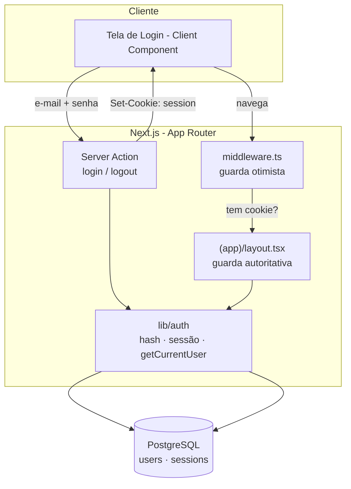

# Design — Autenticação

> **Camada 3 — O DETALHE TÉCNICO.** A planta baixa da implementação. Quem for codar
> deve conseguir seguir este documento sem precisar inventar decisões importantes.

## 1. Arquitetura



Camadas:
- **`lib/auth`** — coração da autenticação, sem dependência de UI. Funções puras de *hashing* e funções
  de sessão que falam com o banco.
- **Server Actions** — orquestram login/logout; única superfície que recebe a senha.
- **middleware + layout** — protegem as rotas (otimista no edge, autoritativa no servidor).
- **UI** — tela de login (shadcn + motion), sem regra de negócio.

## 2. Modelo de Dados

### Nova tabela: `sessions`

```
Tabela: sessions
- id          uuid         PK  default random        -- id interno da sessão
- token_hash  varchar(64)  NOT NULL  UNIQUE           -- SHA-256 (hex) do token do cookie
- user_id     uuid         NOT NULL  FK users(id) ON DELETE CASCADE
- expires_at  timestamptz  NOT NULL                   -- agora + SESSION_MAX_AGE
- created_at  timestamptz  NOT NULL  defaultNow
- user_agent  varchar(255) NULL                       -- diagnóstico/auditoria (opcional)
```

- **Relacionamentos:** `sessions.user_id` → `users.id` (N sessões por usuário; `ON DELETE CASCADE`).
- **Índices:** `UNIQUE(token_hash)` (lookup por cookie); índice em `user_id` (revogar todas as sessões
  de um usuário); índice em `expires_at` (limpeza de expiradas).
- **Migração:** `npm run db:generate` a partir do schema → `npm run db:migrate`. Aditiva (só cria tabela).

> **Por que `token_hash` e não o token cru?** O cookie carrega o token em claro; no banco guardamos só
> o SHA-256 dele. Assim, um vazamento do banco não permite reconstruir cookies válidos (RN-06 / risco
> "vazamento" do plan §6). SHA-256 é suficiente aqui porque o token já tem 256 bits de entropia.

`users` **não muda** — já tem `passwordHash`, `role`, `active`.

## 3. Contratos de API / Interfaces

Não há REST público; a interface são **Server Actions** e o **helper de sessão**.

### `loginAction(formData)` — Server Action

- **Descrição:** valida credenciais, cria sessão, seta cookie, redireciona.
- **Entrada:** `email: string`, `password: string`, `redirectTo?: string` (campo oculto, opcional).
- **Saída (sucesso):** `Set-Cookie: session=<token>` + `redirect(redirectTo ?? "/")`.
- **Saída (erro):** retorna `{ error: "E-mail ou senha inválidos." }` (estado do formulário) — mensagem
  **sempre genérica** (RN-03), tanto para e-mail inexistente quanto senha errada quanto conta inativa.
- **Validações:** `zod` (`email` formato válido; `password` não-vazio). Falha de schema → mesma
  mensagem genérica ou mensagem por campo, sem vazar existência da conta.

### `logoutAction()` — Server Action

- **Descrição:** revoga a sessão atual no banco e apaga o cookie.
- **Saída:** deleta a linha em `sessions` correspondente ao `token_hash` do cookie, limpa o cookie,
  `redirect("/login")`.

### `getCurrentUser(): Promise<SessionUser | null>` — helper de servidor

- Lê o cookie `session` → calcula `token_hash` → busca sessão **não expirada** cujo usuário esteja
  **ativo** → retorna `{ id, name, email, role }` ou `null`.
- Efeito colateral: se a sessão existir mas estiver expirada, é apagada (limpeza preguiçosa).
- Usado por layouts, Server Components e Server Actions das demais features (base do RBAC).

### `lib/auth` — superfície interna

```ts
// password.ts
hashPassword(plain: string): Promise<string>          // formato: "scrypt$<saltHex>$<hashHex>"
verifyPassword(plain: string, stored: string): Promise<boolean>  // comparação em tempo constante

// session.ts
createSession(userId: string, userAgent?: string): Promise<{ token: string; expiresAt: Date }>
validateSession(token: string): Promise<SessionUser | null>
invalidateSession(token: string): Promise<void>
invalidateAllSessions(userId: string): Promise<void>  // usado ao desativar conta (spec 002)
```

## 4. Fluxos Principais

**Login (feliz) — CA-01:**
1. Pessoa abre `/login`, preenche e-mail/senha, envia (Server Action).
2. `zod` valida o formato. E-mail é normalizado (`trim` + `toLowerCase`, RN-07).
3. Busca usuário ativo por e-mail. `verifyPassword` confere o hash.
4. `createSession` gera token (32 bytes aleatórios → base64url), grava `token_hash` + `expiresAt = now + 8h`.
5. Seta cookie `session` (`HttpOnly`, `SameSite=Lax`, `Secure` se prod, `maxAge = SESSION_MAX_AGE`).
6. `redirect(redirectTo ?? "/")`.

**Login (erro) — CA-02/CA-03:**
- E-mail inexistente, senha errada **ou** conta inativa → **mesma** mensagem genérica (RN-03/RN-02).
- Para mitigar *timing attack* de enumeração, executar uma verificação de hash "dummy" quando o e-mail
  não existir, mantendo o tempo de resposta semelhante.

**Navegação autenticada — CA-04:**
1. Requisição a uma rota interna passa pela middleware: se **não há** cookie `session`, redireciona a
   `/login?redirectTo=<rota>` (otimista, sem tocar no banco).
2. Se há cookie, segue; o `(app)/layout.tsx` chama `getCurrentUser()`. Se vier `null` (expirada/revogada/
   inativa), `redirect("/login")`. Caso contrário, renderiza com o usuário disponível por contexto/props.

**Logout — CA-06:**
1. Pessoa aciona logout (Server Action). `invalidateSession` deleta a linha; cookie é limpo; vai a `/login`.
2. Qualquer requisição seguinte com o token antigo falha na validação (não existe mais no banco).

**Sessão expirada — CA-08:**
- `validateSession` ignora (e apaga) sessões com `expiresAt <= now` → tratada como anônima → login.

## 5. Telas / UI

> **Mobile first (CLAUDE.md §4)** e **tokens/padrões de `docs/design-system.md` (CLAUDE.md §5).**
> Projetada primeiro para ~360px; cores via tokens semânticos (verde da marca em ações primárias e foco).

### `/login`

Layout (mobile, base):
```
┌─────────────────────────────┐
│                             │
│        [ logo/ícone ]       │
│      controlbio · ponto     │
│                             │
│  ┌───────────────────────┐  │  ← <Card> shadcn, w-full, max-w-sm
│  │ Entrar                │  │
│  │                       │  │
│  │ E-mail                │  │  ← <Label> + <Input type=email>
│  │ [___________________] │  │
│  │ Senha                 │  │  ← <Label> + <Input type=password>
│  │ [___________________] │  │
│  │                       │  │
│  │ ⚠ E-mail ou senha     │  │  ← alerta de erro (condicional)
│  │   inválidos.          │  │
│  │                       │  │
│  │ [      Entrar       ] │  │  ← <Button> w-full, h-11 (≥44px), estado loading
│  └───────────────────────┘  │
│                             │
└─────────────────────────────┘
```

- **Mobile (base):** `Card` ocupa a largura com padding confortável, campos empilhados, botão
  full-width e alto (`h-11`). Centralizado vertical/horizontal (`min-h-dvh flex items-center justify-center p-4`).
- **`sm:`+:** `Card` ganha `max-w-sm` e fica centralizado num fundo mais espaçoso; tipografia do título cresce.
- **Componentes shadcn:** `card`, `form` (react-hook-form + zod), `input`, `label`, `button`, `sonner`
  (toast para feedback). Ícone via `lucide-react`.
- **Animação (motion):** o `Card` entra com fade + leve translate-y (`initial/animate`); o botão dá um
  micro-feedback ao clicar. Tudo sutil e **respeitando `prefers-reduced-motion`**.
- **Estados:** *idle* · *enviando* (botão com spinner e `disabled`) · *erro* (mensagem genérica) ·
  *sucesso* (redirect). Sem estado vazio (formulário é sempre o conteúdo).
- **Acessibilidade:** `label` associada a cada `input`, `aria-invalid`/`aria-describedby` no erro, foco
  inicial no campo de e-mail, submit por Enter.

### Logout

- Não é tela; é um `Button`/item de menu na área interna que dispara `logoutAction`. (O menu em si nasce
  na primeira tela interna; aqui basta a action e um botão mínimo para validar o fluxo.)

## 6. Validações & Tratamento de Erros

| Situação                              | Regra (ref. RN) | Resposta ao usuário                              |
| ------------------------------------- | --------------- | ------------------------------------------------ |
| E-mail em formato inválido            | RF-01 / zod     | Erro no campo: "Informe um e-mail válido."       |
| Senha vazia                           | zod             | Erro no campo: "Informe a senha."                |
| E-mail inexistente                    | RN-03           | Genérico: "E-mail ou senha inválidos."           |
| Senha incorreta                       | RN-03           | Genérico: "E-mail ou senha inválidos."           |
| Conta inativa                         | RN-02 / RN-03   | Genérico: "E-mail ou senha inválidos."           |
| Excesso de tentativas (RF-09)         | RN (força bruta)| "Muitas tentativas. Tente novamente em instantes." |
| Sessão expirada/revogada              | RN-04 / RN-05   | Redireciona a `/login` (sem mensagem de erro).   |

> **RF-09 (rate limit):** versão inicial simples — limitar por **e-mail + IP** (ex.: 5 tentativas / 15 min)
> usando um contador em memória do servidor. Se houver múltiplas instâncias no futuro, migrar para um
> contador no banco/Redis. Marcado como *Should*; pode ir num segundo PR sem travar o login.

## 7. Segurança & Privacidade

- **Senha:** `scrypt` (node:crypto), *salt* aleatório de 16 bytes por usuário, parâmetros recomendados
  (N=2^16, r=8, p=1), saída `scrypt$<saltHex>$<hashHex>`, verificação em **tempo constante**
  (`crypto.timingSafeEqual`).
- **Token de sessão:** 32 bytes de `crypto.randomBytes` → base64url; no banco só o `SHA-256`.
- **Cookie:** `HttpOnly`, `SameSite=Lax`, `Secure` (prod), `Path=/`, `maxAge = SESSION_MAX_AGE`.
- **Anti-enumeração:** mensagem genérica + verificação dummy de hash (timing).
- **Fixação de sessão:** token novo a cada login; nada reaproveitado.
- **LGPD:** sessão guarda só `user_id` (+ `user_agent` opcional para auditoria). Nenhum dado sensível
  no cookie ou no token.

## 8. Observabilidade

- **Logs:** login bem-sucedido (userId, sem senha), login falho (e-mail mascarado + motivo categórico:
  `not_found` | `bad_password` | `inactive`), logout, bloqueio por rate limit. **Nunca** logar senha/token.
- **Métricas (futuro):** taxa de falha de login, sessões ativas, expirações.
- **Alertas (futuro):** pico de falhas de login (possível ataque).

## 9. Mapa Spec → Design

| Requisito (spec) | Onde é atendido no design                                              |
| ---------------- | ---------------------------------------------------------------------- |
| RF-01            | §5 tela `/login`                                                       |
| RF-02            | §3 `loginAction` + §4 fluxo feliz                                      |
| RF-03            | §2 tabela `sessions` + §3 `createSession`/cookie                       |
| RF-04 / RN-03    | §4 fluxo de erro + §6 (mensagem genérica + dummy hash)                 |
| RF-05 / RN-05    | §3 `logoutAction`/`invalidateSession` + §4 logout                      |
| RF-06            | §1/§4 middleware + guarda no `(app)/layout.tsx`                        |
| RF-07            | §4 navegação (redirect de logado para fora de `/login`)               |
| RF-08            | §3 `redirectTo` + §4 navegação (middleware grava a rota de origem)     |
| RF-09            | §6 rate limit (Should)                                                 |
| RF-10 / CA-07    | §5 layout mobile first                                                  |
| RN-01 / RN-07    | §7 hashing + §4 normalização de e-mail                                  |
| RN-02            | §3 `getCurrentUser`/`validateSession` (filtra `active`) + §4 erro      |
| RN-04 / CA-08    | §2 `expires_at` + §4 sessão expirada                                    |
| RN-06            | §7 cookie + §2 `token_hash`                                            |