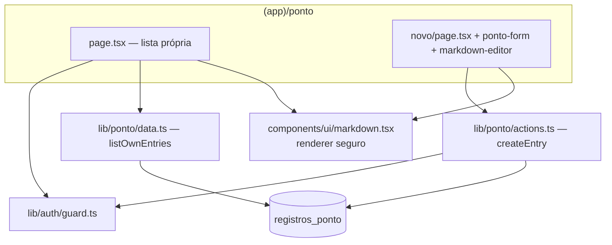

# Design — Registro de Ponto

> **Camada 3 — O DETALHE TÉCNICO.**

## 1. Arquitetura



Tudo escopado ao usuário autenticado. O `<Markdown>` é usado tanto no **preview** (editor, client)
quanto na **lista** (server) — é um componente puro (sem hooks/DOM), seguro nos dois lados.

## 2. Modelo de Dados

### Nova tabela: `registros_ponto`
```
Tabela: registros_ponto
- id            uuid         PK  default random
- user_id       uuid         NOT NULL  FK users(id) ON DELETE CASCADE
- work_date     date         NOT NULL                 -- o dia trabalhado (YYYY-MM-DD)
- worked_minutes integer     NOT NULL                 -- total de minutos (> 0, ≤ 1440)
- description   text         NOT NULL                 -- Markdown (subset seguro)
- created_at    timestamptz  NOT NULL  defaultNow
```
- **Índice:** `(user_id, work_date desc)` para a listagem pessoal.
- **Migração:** `db:generate` → `db:migrate` (aditiva).
- Drizzle: `workDate` como `date({ mode: "string" })`; `workedMinutes` `integer`.

## 3. Interfaces (servidor)

### `lib/ponto/validation.ts`
```ts
createEntrySchema: {
  workDate: string  // YYYY-MM-DD, não-futuro (refine)
  hours: number     // 0..24 (coerce)
  minutes: number   // 0..59 (coerce)
  description: string // 1..5000 (trim)
} + refine: hours*60 + minutes ∈ [1, 1440]
```

### `lib/ponto/data.ts`
```ts
listOwnEntries(userId: string): Promise<Entry[]>  // where user_id = userId, order by work_date desc, created_at desc
// Entry = { id, workDate, workedMinutes, description, createdAt }
```

### `lib/ponto/actions.ts`
```ts
type ActionState = { error?: string; fieldErrors?: Record<string,string> }
createEntry(prev, formData): Promise<ActionState>
// requirePermission("ponto:registrar"); valida; insere com user_id = currentUser.id;
// redirect("/ponto?ok=registrado").
```

### `components/ui/markdown.tsx`
```ts
<Markdown source={string} className?={string} />
```
Renderiza um **subset seguro** de Markdown como elementos React (ver §5/§7). **Sem** `dangerouslySetInnerHTML`.

## 4. Fluxos Principais

**Registrar (CA-01..05):** usuário abre `/ponto/novo` → informa dia (default hoje), horas/minutos e
descrição (com toolbar + preview) → `createEntry` valida (tempo > 0 e ≤ 24h; dia não-futuro; descrição
1–5000) → insere com `user_id = currentUser.id` → volta para `/ponto` com toast.

**Listar (CA-06/07):** `/ponto` chama `requirePermission("ponto:ver_proprio")`, `listOwnEntries(currentUser.id)`
→ renderiza cards (data formatada, "Xh Ymin", descrição via `<Markdown>`). Cada um vê só o seu.

**Segurança da descrição (CA-08):** o `<Markdown>` nunca injeta HTML; texto vira nós React (escapados);
`<script>` aparece como texto literal; links com esquema fora de http/https/mailto **não** viram `<a>`.

## 5. Telas / UI

> **Mobile first** + tokens do design system.

### `/ponto` (lista própria)
- Cabeçalho: título "Meus registros" + botão "Novo registro" (Link → `/ponto/novo`).
- **Lista de cards** (uma coluna; é a visão primária no mobile e desktop):
  - Topo do card: **data** (`DD/MM/AAAA`, derivada de work_date) + **tempo** em `Badge`/destaque (`8h 30min`).
  - Corpo: **descrição** renderizada (`<Markdown>`), com `prose`-like via classes utilitárias (espaçamento
    de parágrafos/listas, links em `text-primary underline`).
- Estado vazio: "Você ainda não registrou nenhum ponto." + chamada para "Novo registro".

### `/ponto/novo` (form)
- `Card` `max-w-lg` centralizado. Campos (`gap-4`):
  - **Dia:** `<input type="date">` (estilizado), default hoje, `max` = hoje.
  - **Tempo trabalhado:** dois `Input type="number"` lado a lado — "Horas" (0–24) e "Minutos" (0–59),
    com rótulos; `inputMode="numeric"`.
  - **Descrição:** `markdown-editor` — abas/toggle **Escrever | Visualizar**:
    - *Escrever:* `<textarea>` + mini-toolbar (Negrito `**`, Itálico `*`, Link `[ ]( )`, Lista `- `) que
      envolve/insere markdown na seleção; dica curta de sintaxe.
    - *Visualizar:* preview via `<Markdown>` do conteúdo atual.
- Botão "Salvar" (`h-11 w-full` no mobile) + "Cancelar" → `/ponto`. Erros por campo + erro geral.
- Entrada com `motion` (fade + y), respeitando `prefers-reduced-motion`.

### Nav (`(app)/layout.tsx`)
- Link **"Ponto"** (`/ponto`) visível a todos os autenticados (gate `can(role,"ponto:ver_proprio")`,
  que ambos os papéis têm), ao lado de "Início"/"Usuários".

## 6. Validações & Tratamento de Erros

| Situação                         | Regra  | Resposta |
| -------------------------------- | ------ | -------- |
| Horas fora de 0–24 / minutos 0–59| RN-01  | Erro no campo de tempo |
| Total de tempo = 0               | RN-01  | "Informe um tempo trabalhado maior que zero." |
| Dia no futuro                    | RN-02  | "O dia não pode ser no futuro." |
| Descrição vazia / > 5000         | RN-03  | "Informe a descrição." / "Descrição muito longa." |
| Link com esquema não permitido   | RN-04  | Renderizado como texto simples (não vira `<a>`) |

## 7. Segurança & Privacidade — renderer Markdown

- **Subset suportado:** `**negrito**`, `*itálico*`/`_itálico_`, `` `código` ``, `[texto](url)`, listas
  com `- `, parágrafos e quebras de linha.
- **Sem HTML cru:** o parser **ignora/escapa** qualquer HTML — monta apenas elementos React conhecidos;
  o texto vira *string children* (React escapa automaticamente). Logo `<script>...` é exibido como texto.
- **Links:** o `href` só é aceito se começar com `http://`, `https://` ou `mailto:` (allowlist). Caso
  contrário, renderiza só o texto. `<a>` recebe `rel="noopener noreferrer"` e `target="_blank"`.
- **Dono:** `user_id` sempre do servidor; nunca confiar em id do cliente. Listagem filtra por dono.

## 8. Observabilidade
- **Logs:** criação de registro (userId, workDate, workedMinutes — **sem** o conteúdo). 

## 9. Mapa Spec → Design

| Requisito | Onde |
| --------- | ---- |
| RF-01     | §2 tabela + §3 `createEntry` + §5 form |
| RF-02     | §5 editor + §7 renderer |
| RF-03     | §3 `listOwnEntries` + §5 lista |
| RF-04     | §5 nav (ambos papéis) + permissões |
| RF-05/RN-05 | §3/§4 dono no servidor + filtro por dono |
| RF-06/CA-09 | §5 mobile first |
| RN-01..03 | §3/§6 validação |
| RN-04/CA-08 | §7 renderer seguro |
