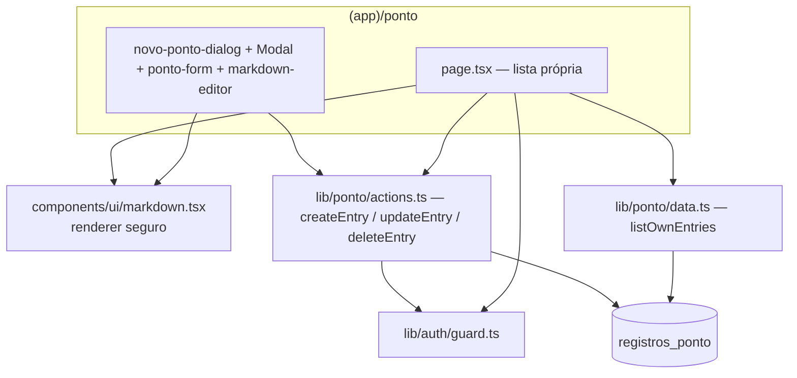

# Design — Registro de Ponto

> **Camada 3 — O DETALHE TÉCNICO.**

## 1. Arquitetura



Tudo escopado ao usuário autenticado. O `<Markdown>` é usado tanto no **preview** (editor, client)
quanto na **lista** (server) — é um componente puro (sem hooks/DOM), seguro nos dois lados.

## 2. Modelo de Dados

### Nova tabela: `registros_ponto`
```
Tabela: registros_ponto
- id            uuid         PK  default random
- user_id       uuid         NOT NULL  FK users(id) ON DELETE CASCADE
- title         varchar(120) NOT NULL                 -- título curto do registro
- work_date     date         NOT NULL                 -- o dia trabalhado (YYYY-MM-DD)
- worked_minutes integer     NOT NULL                 -- total de minutos (> 0, ≤ 1440)
- description   text         NOT NULL                 -- Markdown (subset seguro)
- link         varchar(2048) NULL                     -- link opcional (ex.: ClickUp), http(s)
- created_at    timestamptz  NOT NULL  defaultNow
```
- **Índice:** `(user_id, work_date desc)` para a listagem pessoal.
- **Migração:** `db:generate` → `db:migrate`. O `title` foi adicionado depois (0005): coluna nullable →
  backfill (1ª linha da descrição, ≤120, fallback "Registro") → `SET NOT NULL`, para não quebrar linhas
  existentes.
- Drizzle: `workDate` como `date({ mode: "string" })`; `workedMinutes` `integer`.

## 3. Interfaces (servidor)

### `lib/ponto/validation.ts`
```ts
createEntrySchema: {
  title: string     // 1..120 (trim) — usado em criar e editar
  workDate: string  // YYYY-MM-DD, não-futuro (refine)
  hours: number     // 0..24 (coerce)
  minutes: number   // 0..59 (coerce)
  description: string // 1..5000 (trim)
  link?: string       // opcional; "" ou URL http(s) válida (url() + refine de esquema)
} + refine: hours*60 + minutes ∈ [1, 1440]
```

### `lib/ponto/data.ts`
```ts
listOwnEntries(userId): Promise<Entry[]>  // where user_id = userId, order by work_date desc, created_at desc
// Entry = { id, title, workDate, workedMinutes, description, link, createdAt }
getOwnHourlyRateCents(userId): Promise<number | null>  // valor/hora do usuário (KPIs)
```

### `lib/ponto/actions.ts`
```ts
type PontoActionState = { ok?; error?; fieldErrors?; created? } // created = nº de registros (split)

createEntry(input): Promise<PontoActionState>
// requirePermission("ponto:registrar"); valida (createEntrySchema, até 744h). Se > 24h, **divide** em
// vários registros (24h/dia) a partir de workDate (mesmo título/descrição/link; dias gerados podem ser
// futuros). Retorna { ok, created }.

updateEntry(id, input): Promise<PontoActionState>
// requirePermission("ponto:editar"); valida com **updateEntrySchema** (1 dia, máx 24h); UPDATE ... WHERE
// id = :id AND user_id = currentUser.id (escopado por dono, RN-05) com .returning() — 0 linhas ⇒ { error }.

deleteEntry(id): Promise<void>
// requirePermission("ponto:excluir"); DELETE ... WHERE id AND user_id = currentUser.id (escopado por dono).
```
> O `PontoForm` usa `createEntrySchema` no criar/replicar (até 744h, sem teto de 24h) e `updateEntrySchema`
> no editar (máx 24h). Acima de 24h, o form mostra uma **dica** com quantos registros serão criados.

### `components/ui/markdown.tsx`
```ts
<Markdown source={string} className?={string} />
```
Renderiza um **subset seguro** de Markdown como elementos React (ver §5/§7). **Sem** `dangerouslySetInnerHTML`.

## 4. Fluxos Principais

**Registrar (CA-01..05):** usuário abre o **modal** "Novo registro" → informa dia (default hoje),
horas/minutos e descrição (com toolbar + preview) → `createEntry` valida (tempo > 0 e ≤ 24h; dia
não-futuro; descrição 1–5000) → insere com `user_id = currentUser.id` → retorna `{ ok: true }`; o
cliente fecha o modal, dá `router.refresh()` na lista e exibe o toast.

**Listar (CA-06/07):** a página servidor faz só o guard (`ponto:ver_proprio`) + valor/hora; o `PontoView`
(client/SPA) busca via **React Query** `fetchOwnEntries(range)` e renderiza KPIs + lista agrupada. Cada um
vê só o seu (a action filtra por dono no servidor).

**Filtrar (RF-16):** `PontoView` tem um **segmented control** (pílulas Semana/Mês/Intervalo; ver design
system §6) — **esta semana** (`getWeekRange`), **este mês** (`getMonthRange`) ou **intervalo** via
`DateRangeField` (calendário em modo range, datas livres cruzando meses). O `range` entra na `queryKey`
`["ponto", from, to]` → refetch; **KPIs e lista** usam os dados filtrados. As mutações
(criar/editar/replicar/excluir) **invalidam** `["ponto"]` (em vez de `router.refresh()`).

**Editar (CA-11):** botão "Editar" no card abre o **modal** com o `PontoForm` em modo `edit` pré-preenchido
→ `updateEntry` valida e atualiza **escopado por dono** → no sucesso o cliente fecha o modal, dá
`router.refresh()` e mostra toast "Registro atualizado.".

**Excluir (CA-12):** botão "Excluir" abre um **modal de confirmação** → confirmar chama `deleteEntry(id)`
(escopado por dono) → fecha, `router.refresh()`, toast "Registro excluído."; cancelar não faz nada.

**Replicar (CA-14):** botão "Replicar" abre o **modal** com o `PontoForm` em modo `create`, com
`presetTitle` (título travado/somente-leitura) e `presetDate` = data do original; o usuário informa
tempo/descrição → `createEntry` cria um **novo** registro → `router.refresh()` + toast "Registro replicado.".

**Agrupar (CA-15):** `buildGroups` (em `page.tsx`) monta `[{ workDate, titleGroups: [{ title, totalMinutes,
entries }] }]`. O `PontoList` (client) renderiza, por dia: título com **1** registro → card normal; com
**2+** → `PontoTitleGroup` colapsável (cabeçalho com título + horas totais; ao abrir, um card por registro).

**Segurança da descrição (CA-08):** o `<Markdown>` nunca injeta HTML; texto vira nós React (escapados);
`<script>` aparece como texto literal; links com esquema fora de http/https/mailto **não** viram `<a>`.

## 5. Telas / UI

> **Mobile first** + tokens do design system.
>
> ⚠️ **Atualização (2026-06-25):** a criação deixou de ser uma página `/ponto/novo` e passou a ser um
> **modal** aberto na própria lista (`NovoPontoDialog` + `Modal` — ver `docs/design-system.md` §6). A rota
> `/ponto/novo` foi removida. O `createEntry` não redireciona mais: retorna `{ ok: true }` e o cliente
> fecha o modal + `router.refresh()` + toast. O conteúdo do formulário abaixo continua igual, só muda
> a moldura (modal em vez de `Card` em página).

### `/ponto` (lista própria)
- Cabeçalho: título "Meus registros" + botão "Novo registro" (abre o **modal** de criação).
- **KPIs** (`PontoKpis`, server) logo abaixo do cabeçalho, grid 2 col: **Horas feitas** e **Valor
  estimado**. Calculados no servidor a partir de `listOwnEntries` (soma de minutos) e do valor/hora do
  usuário (`getOwnHourlyRateCents`). Valor = `minutos × cents ÷ 60` (RN-12), exibido em **verde**
  (`text-primary`), com o **valor/hora** do usuário como subtítulo (ex.: "R$ 50,00/h"); "—" + dica sem taxa.
  São **totais** (vão acompanhar os filtros da lista quando existirem).
- **Agrupada por data e por título** (`PontoList`, client): os registros (já ordenados por `work_date`
  desc) são agrupados por dia, cada bloco com **cabeçalho** com o rótulo amigável da data
  (`formatEntryDateLabel`, `lib/ponto/dates.ts`): **"Hoje"/"Ontem"**, o **dia da semana** se for da semana
  atual (segunda → "Segunda-feira"), ou a data **por extenso** ("21 de junho de 2026"). A data **não** se
  repete em cada card. Dentro do dia, registros de **mesmo título** viram um grupo colapsável
  (`PontoTitleGroup`): cabeçalho com título + **horas totais** (soma) e contagem; ao abrir, um card por
  registro. Título único no dia → card normal.
- **Card de registro** (`PontoEntryCard`, client):
  - Topo: **título** (oculto quando dentro de um grupo) + **tempo** em `Badge` (`8h 30min`).
  - Corpo: **descrição** renderizada (`<Markdown>`), com `prose`-like via classes utilitárias (espaçamento
    de parágrafos/listas, links em `text-primary underline`).
  - Topo-direito (`PontoEntryActions`, client): **ícones discretos** — **abrir link** (external-link, só
    quando houver link http(s); `<a target="_blank" rel="noopener noreferrer">`), **replicar** (copy),
    **editar** (lápis) e **excluir** (lixeira) — `ghost`, `text-muted-foreground`, `size-8`; lixeira
    `destructive` só no hover. Edição/replicar/excluir conforme `ponto:editar`/`registrar`/`excluir`.
- Estado vazio: "Você ainda não registrou nenhum ponto." + chamada para "Novo registro".

### Modal "Novo registro" / "Editar registro" / "Replicar registro" (form)
- `PontoForm` (modos `create`/`edit`; replicar = `create` com `presetTitle`+`presetDate`) dentro do
  `Modal` (bottom sheet no mobile, centralizado `max-w-lg` no desktop). Campos (`gap-4`):
  - **Título:** `<Input>` texto, obrigatório, ≤ 120 (somente-leitura no replicar).
  - **Dia:** `DateField` (`Calendar`/react-day-picker, pt-BR) — calendário em **popover flutuante**
    (portal), default hoje (ou data do original no replicar), `max` = hoje (ver design system §6).
  - **Link (opcional):** `<Input type="url">` — ex.: tarefa no ClickUp; validado como http(s).
  - **Tempo trabalhado:** dois `Input type="number"` lado a lado — "Horas" (0–24) e "Minutos" (0–59),
    com rótulos; `inputMode="numeric"`.
  - **Descrição:** `markdown-editor` — abas/toggle **Escrever | Visualizar**:
    - *Escrever:* `<textarea>` + mini-toolbar (Negrito `**`, Itálico `*`, Link `[ ]( )`, Lista `- `) que
      envolve/insere markdown na seleção; dica curta de sintaxe.
    - *Visualizar:* preview via `<Markdown>` do conteúdo atual.
- Botão "Salvar registro" (criar) / "Salvar alterações" (editar) + "Cancelar" (fecha o modal). Erros por
  campo + erro geral. A exclusão tem um modal de **confirmação** próprio (botão destrutivo).
- Animação de abertura/fechamento é do próprio `Modal` (`motion`), respeitando `prefers-reduced-motion`.

### Nav (`(app)/layout.tsx`)
- Link **"Ponto"** (`/ponto`) visível a todos os autenticados (gate `can(role,"ponto:ver_proprio")`,
  que ambos os papéis têm), ao lado de "Início"/"Usuários".

## 6. Validações & Tratamento de Erros

| Situação                         | Regra  | Resposta |
| -------------------------------- | ------ | -------- |
| Horas fora de 0–24 / minutos 0–59| RN-01  | Erro no campo de tempo |
| Total de tempo = 0               | RN-01  | "Informe um tempo trabalhado maior que zero." |
| Dia no futuro                    | RN-02  | "O dia não pode ser no futuro." |
| Descrição vazia / > 5000         | RN-03  | "Informe a descrição." / "Descrição muito longa." |
| Link com esquema não permitido   | RN-04  | Renderizado como texto simples (não vira `<a>`) |

## 7. Segurança & Privacidade — renderer Markdown

- **Subset suportado:** `**negrito**`, `*itálico*`/`_itálico_`, `` `código` ``, `[texto](url)`, listas
  com `- `, parágrafos e quebras de linha.
- **Sem HTML cru:** o parser **ignora/escapa** qualquer HTML — monta apenas elementos React conhecidos;
  o texto vira *string children* (React escapa automaticamente). Logo `<script>...` é exibido como texto.
- **Links:** o `href` só é aceito se começar com `http://`, `https://` ou `mailto:` (allowlist). Caso
  contrário, renderiza só o texto. `<a>` recebe `rel="noopener noreferrer"` e `target="_blank"`.
- **Dono:** `user_id` sempre do servidor; nunca confiar em id do cliente. Listagem filtra por dono.

## 8. Observabilidade
- **Logs:** criação de registro (userId, workDate, workedMinutes — **sem** o conteúdo). 

## 9. Mapa Spec → Design

| Requisito | Onde |
| --------- | ---- |
| RF-01     | §2 tabela + §3 `createEntry` + §5 form |
| RF-02     | §5 editor + §7 renderer |
| RF-03     | §3 `listOwnEntries` + §5 lista |
| RF-04     | §5 nav (ambos papéis) + permissões |
| RF-05/RN-05 | §3/§4 dono no servidor + filtro por dono |
| RF-06/CA-09 | §5 mobile first |
| RN-01..03 | §3/§6 validação |
| RN-04/CA-08 | §7 renderer seguro |
