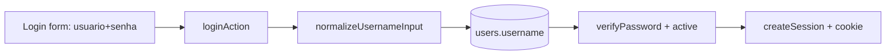

# Design — Login por primeiro nome

> **Camada 3 — O DETALHE TÉCNICO.** Implementação da spec [`004-login-por-nome`](./spec.md).
> Modifica pontos da autenticação (spec 001) e do CRUD de usuários (spec 002).

## 1. Arquitetura

Sem mudança arquitetural: continuam Server Actions + `lib/auth` + sessão no servidor. A única
diferença conceitual é que o **identificador de busca** do usuário passa de `email` para `username`.



## 2. Modelo de Dados

Tabela `users` (alterada):

```
- username   varchar(120)  NOT NULL  UNIQUE   -- login normalizado (a-z0-9), derivado do 1o nome
- email      varchar(255)  NULL      UNIQUE   -- agora OPCIONAL; nao usado para login
```

- **Migração:** adicionar `username` em três passos (coluna nullable → backfill
  `lower(split_part(name,' ',1))` → `SET NOT NULL` + `UNIQUE`), para não quebrar linhas existentes.
  Tornar `email` nullable (`DROP NOT NULL`). A constraint UNIQUE de `email` é mantida (Postgres
  permite múltiplos `NULL` sob UNIQUE).
- **Observação:** o backfill SQL não remove acentos (não há `unaccent` por padrão). Como o dataset
  atual é só o admin de seed, é aceitável; o admin pode ajustar o próprio username depois.

## 3. Contratos / Interfaces

### `normalizeToken(raw): string`  (`src/lib/auth/username.ts`)

`raw.normalize("NFD")` → remove diacríticos → `toLowerCase()` → remove tudo que não é `a-z0-9`.

- `deriveUsernameFromName(name)` → aplica `normalizeToken` no **primeiro token** do nome.
- `normalizeUsernameInput(raw)` → aplica `normalizeToken` no texto digitado no login.

### `loginSchema` (`src/lib/auth/validation.ts`)

```
{ username: string (trim → normalizeUsernameInput, >=1 após normalizar), password: string >=1 }
```

### `createUserSchema` / `updateUserSchema` (`src/lib/usuarios/validation.ts`)

```
name:     string trim >=2
username: string → normalizeToken, >=2 (RN-05)
email:    opcional — "" ou e-mail válido (trim+lower)
role:     admin | funcionario
password: criar=>=8 · editar=opcional/""
```

## 4. Fluxos Principais

**Login (feliz):** usuário digita `Andrey` → normaliza para `andrey` → busca `users.username` →
`verifyPassword` + `active` → cria sessão → redirect.

**Login (erro/inexistente):** username não encontrado → `verifyPassword` dummy (anti-timing) →
mensagem genérica.

**Cadastro:** admin digita o nome; o form sugere o username (1º nome normalizado) enquanto o campo
não foi tocado manualmente. No submit, `createUser` checa unicidade de `username` (e de `email` se
informado). Colisão → erro de campo pedindo outro username (RN-04).

## 5. Telas / UI

Segue `docs/design-system.md`; reusa os mesmos componentes (Card/Input/Label/Button), só mudam campos.

- **Login** (`login-form.tsx`): troca o campo "E-mail" (`type=email`) por **"Usuário"**
  (`type=text`, `autoComplete="username"`, `autoCapitalize="none"`, `autoCorrect="off"`,
  `spellCheck=false`, `inputMode="text"`), placeholder ex. "seu primeiro nome". `autoFocus`.
- **Form de usuário** (`user-form.tsx`): novo campo **"Usuário (login)"** logo após Nome, com
  sugestão automática a partir do nome (client-side) até o admin editar manualmente. E-mail vira
  **"E-mail (opcional)"**, sem `required`.
- **Lista** (`usuarios/page.tsx`): exibe o **usuário** (`@username`) como identificador secundário
  (substitui o e-mail como info principal de identificação); e-mail mostrado só quando existir.
  Busca passa a considerar nome, username e e-mail.

> Mobile-first mantido: campos em coluna, alvos >= 44px, sem hover essencial, ok em ~360px.

## 6. Validações & Tratamento de Erros

| Situação                                      | Regra | Resposta ao usuário                                     |
| --------------------------------------------- | ----- | ------------------------------------------------------- |
| Username vazio após normalizar                | RN-05 | "Informe um usuário válido."                            |
| Username já existe (criar/editar)             | RN-04 | "Já existe um usuário com este login." (campo username) |
| E-mail informado já existe                    | RN-06 | "Já existe um usuário com este e-mail." (campo email)   |
| Login não encontrado / senha errada / inativo | RN-07 | "Usuário ou senha inválidos." (genérica)                |

## 7. Segurança & Privacidade

- Mantida a verificação dummy de hash para evitar enumeração por timing.
- Mensagem de login permanece genérica.
- Username não é segredo (é o login); a proteção continua sendo a senha + sessão no servidor.

## 8. Observabilidade

Sem novos logs/métricas. Reusa o comportamento da spec 001.

## 9. Mapa Spec → Design

| Requisito | Onde é atendido                                                     |
| --------- | ------------------------------------------------------------------- |
| RF-01     | `login-form.tsx` (campo Usuário) + `loginSchema`                    |
| RF-02     | `normalizeUsernameInput` em `loginSchema` / `loginAction`           |
| RF-03     | sugestão client-side em `user-form.tsx` + `deriveUsernameFromName`  |
| RF-04     | unicidade em `createUser`/`updateUser` + UNIQUE em `users.username` |
| RF-05     | `email` nullable no schema + opcional na validação/form             |
| RF-06     | `listUsers` (busca por username) + `usuarios/page.tsx`              |
| RN-01..07 | seções 2–6                                                          |