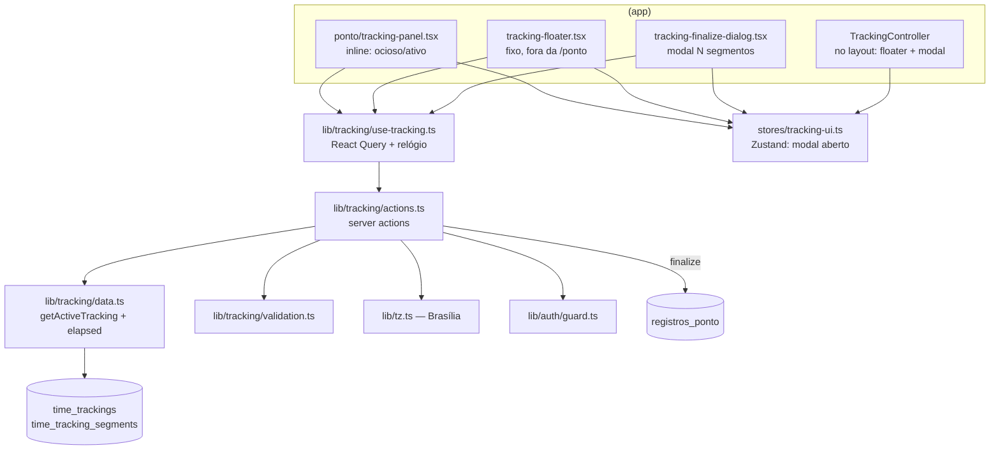

# Design — Tracking de Tempo (Cronômetro de Ponto)

> **Camada 3 — O DETALHE TÉCNICO.** Planta baixa da implementação.

## 1. Arquitetura



O tracking é **sempre próprio** (dono = sessão). O relógio ao vivo é só exibição; a verdade é o servidor.

## 2. Modelo de Dados

### Nova tabela: `time_trackings` (o rascunho / sessão de cronômetro)
```
- id          uuid          PK  default random
- user_id     uuid          NOT NULL  FK users(id) ON DELETE CASCADE  UNIQUE  -- 1 por usuário (RN-01)
- title       varchar(120)  NOT NULL
- project     project(enum) NOT NULL                                          -- reusa enum "project" (dw|labphase)
- created_at  timestamptz   NOT NULL  default now
- updated_at  timestamptz   NOT NULL  default now  $onUpdate
```

### Nova tabela: `time_tracking_segments` (trechos play→pause)
```
- id          uuid         PK  default random
- tracking_id uuid         NOT NULL  FK time_trackings(id) ON DELETE CASCADE
- started_at  timestamptz  NOT NULL
- ended_at    timestamptz  NULL          -- NULL = segmento ABERTO (rodando)
- created_at  timestamptz  NOT NULL  default now
```
- **Índices:** `idx(tracking_id)`; **índice único parcial** `unique(tracking_id) WHERE ended_at IS NULL`
  → no máx. **um** segmento aberto por tracking (RN-05/16).
- **Estado derivado:** `rodando` ⇔ existe segmento com `ended_at IS NULL`; senão `pausado`.
- **Migração:** `db:generate` → `db:migrate`. Só cria tabelas (não altera existentes). Drizzle usa o
  `projectEnum` já existente em `schema.ts`.

## 3. Fuso de Brasília — `src/lib/tz.ts`
```ts
export const BRASILIA_TZ = "America/Sao_Paulo";
// "YYYY-MM-DD" do instante em Brasília (default: agora). Base do work_date (RN-14).
export function brasiliaDateISO(date?: Date): string; // Intl "en-CA" + timeZone
export function todayBrasiliaISO(): string;           // = brasiliaDateISO()
```
> `todayISODate()` (em `ponto/validation.ts`) continua para o fluxo de ponto normal; o **tracking** usa
> sempre `tz.ts` (RN-14). A finalização valida "não-futuro" contra `todayBrasiliaISO()`.

## 4. Interfaces (servidor)

### `lib/tracking/validation.ts`
```ts
startTrackingSchema:   { title: 1..120 (trim), project: "dw"|"labphase" }
finalizeSegmentSchema: { id: uuid, workDate: /^\d{4}-\d{2}-\d{2}$/, hours: 0..24, minutes: 0..59,
                         description: 1..5000 }  + refine tempo ∈ [1,1440]
finalizeTrackingSchema:{ title: 1..120, project, segments: finalizeSegmentSchema[] (min 1) }
                         + refine: todo workDate ≤ todayBrasiliaISO()  (não-futuro, RN-10)
// Ajuste de início não é zod puro (depende do estado): validado na action.
```

### `lib/tracking/data.ts`
```ts
type SegmentDTO = { id: string; startedAt: string; endedAt: string | null }; // ISO
type ActiveTracking = {
  id: string; title: string; project: Project;
  status: "running" | "paused";
  segments: SegmentDTO[];          // ordenados por started_at asc
  elapsedMs: number;               // Σ (endedAt ?? serverNow) − startedAt
  serverNow: string;               // ISO — âncora p/ o relógio do client
  todayBrasilia: string;           // YYYY-MM-DD — max do DateField no modal
};
getActiveTracking(userId): Promise<ActiveTracking | null>;
```

### `lib/tracking/actions.ts` (todas `"use server"`, escopadas por dono, RN-13)
```ts
type TrackingActionState = { ok?: boolean; error?: string; fieldErrors?: Record<string,string>; created?: number };

fetchActiveTracking(): Promise<ActiveTracking | null>   // requirePermission("ponto:ver_proprio")
startTracking(input): Promise<TrackingActionState>       // registrar; 409 se já existe (RN-01); cria tracking + 1º segmento (now)
pauseTracking(): Promise<TrackingActionState>            // registrar; fecha segmento aberto (ended_at=now); no-op se já pausado (RN-06)
resumeTracking(): Promise<TrackingActionState>           // registrar; se pausado, abre novo segmento (started_at=now) (RN-06)
adjustCurrentStart(startedAtISO): Promise<TrackingActionState> // registrar; valida: ≤ now e ≥ ended_at do anterior (RN-07); exige segmento aberto
stopTracking(): Promise<TrackingActionState>             // registrar; fecha segmento aberto (se houver). NÃO apaga. Client abre o modal (RN-08)
finalizeTracking(input): Promise<TrackingActionState>    // registrar; valida finalizeTrackingSchema; TX: insere N registros_ponto + apaga tracking (cascade). created=N (RN-10)
discardTracking(): Promise<TrackingActionState>          // registrar; apaga o rascunho sem gerar ponto (RN §10 aberto)
```
- **Dono:** todas as escritas usam `WHERE ... user_id = session.id` (join via tracking). Id de outro não tem efeito.
- **Atomicidade:** `finalizeTracking` roda em `db.transaction`.
- **work_date por segmento:** default no client = `brasiliaDateISO(new Date(startedAt))`; o valor final vem do form (editável).

## 5. Cliente — `lib/tracking/use-tracking.ts`
```ts
useActiveTracking(): { data, isPending, dataUpdatedAt, ... }   // useQuery(["tracking"], fetchActiveTracking)
useTrackingClock(t, dataUpdatedAt): { totalMs, currentBlockMs }
   // totalMs = t.elapsedMs + extra;  currentBlockMs = (base do segmento atual) + extra
   // extra = running ? (now - dataUpdatedAt) : 0;  `now` é state via setInterval (não Date.now() no render)
useTrackingControls(): { start, pause, resume, adjust, stop, finalize, discard }
   // cada uma: ação → invalidate(["tracking"]); finalize também invalidate(["ponto"])
```
- Relógio ancorado em `dataUpdatedAt` do React Query (instante em que o dado chegou) → sem drift/tz. Mostra
  **dois tempos**: o do **bloco atual** (grande) e o **total** (menor).
- `refetchOnWindowFocus: true` **só** nesta query (sobrepondo o default do provider) para reidratar ao
  voltar de outra aba/tela (RN-04).

## 6. Fluxos Principais

1. **Iniciar (CA-01):** painel ocioso → título + projeto → `startTracking` (cria tracking + 1º segmento).
   Query invalida; painel vira "ativo", relógio corre. Já existe tracking → erro "Você já tem um cronômetro
   ativo." (RN-01/CA-03).
2. **Persistir (CA-02):** o relógio depende só de `started_at`; refresh/logout/login → `fetchActiveTracking`
   recalcula `elapsedMs` no servidor. Nada zera.
3. **Pause/Resume (CA-04):** `pauseTracking` fecha o segmento (sem modal, sem ponto); `resumeTracking` abre
   um novo (o "duplicar"). Botão alterna pause↔play conforme `status`.
4. **Ajustar início (CA-05):** **clicar no relógio** abre um popover ("card-tooltip") com input de **texto**
   de horário (`HH:MM` ou `2340`) + **data opcional** (default = dia em que começou) → `adjustCurrentStart`
   valida no servidor (≤ agora; ≥ fim do anterior) → recomputa. Futuro/sobreposição → erro.
5. **Encerrar (CA-06):** `stopTracking` fecha o segmento; client abre o **modal** (Zustand `finalizeOpen`).
6. **Finalizar (CA-07/08):** modal com `useFieldArray` (1 bloco por segmento) → `finalizeTracking` cria N
   pontos (mesmo título/projeto; descrição/tempo/dia por segmento) numa TX e apaga o rascunho → invalida
   `["tracking"]` e `["ponto"]`, toast "N pontos criados.".
7. **Cancelar (CA-09):** fecha o modal; rascunho continua **pausado** (pode retomar/encerrar) (RN-12).
8. **Descartar:** ação com confirmação → `discardTracking` apaga o rascunho.

## 7. Telas / UI

> **Mobile first** + tokens do design system. Alvos ≥ 44px, sem scroll horizontal.

### `TrackingPanel` (inline no topo da `/ponto`, acima dos KPIs)
- **Ocioso:** `Card` com **Título** (`Input`, obrigatório) + **Projeto** (radiogroup, igual ao form) +
  botão **"Iniciar cronômetro"** (ícone `Play`). Validação leve (título 1–120) com RHF+Zod.
- **Ativo:** `Card` destacado (`border-primary/30` + gradiente `from-primary/5`) com:
  - **Título** + `Badge` do projeto; selo **"Rodando"/"Pausado"**; "N blocos" quando > 1 segmento.
  - **Relógio** (`font-mono tabular-nums`, ao vivo, reduce-motion ok): grande = **bloco atual** `HH:MM:SS`;
    logo abaixo, menor, **"Total HH:MM:SS"**. Quando **rodando**, o relógio do bloco é um **botão**: clicá-lo
    abre o popover de **ajuste de início** (§6.4) — não há mais botão "Ajustar início".
  - **Controles** (botões ≥ 44px): **Pausar/Retomar** (alterna), **Encerrar** (`Square`, `primary`),
    **Descartar** (lixeira `destructive`, confirmação inline).
  - **Popover de ajuste** (`AdjustPopover`): card ancorado sob o relógio (`absolute top-full right-0`,
    fecha em clique-fora/Esc) com **Horário** (`Input` texto; parse `parseTimeToHM`: `HH:MM`/`HHMM`/`HMM`/`HH`)
    e **Data (opcional)** (`Input type=date`, default = dia do início). "Cancelar" / "Salvar".

### `TrackingFloater` (fixo, `(app)/layout`)
- `motion.div` `fixed inset-x-0 bottom-0` (respeita `safe-area`), **escondido** quando: sem tracking ativo
  **ou** rota = `/ponto` (usa `usePathname`). `AnimatePresence` na entrada/saída.
- Conteúdo: **título** (truncado) · **tempo** (`Xh Ymin`, ou `MM:SS` se < 1h) + **Pause/Play** + **Encerrar**.
- Largura contida (`max-w-5xl mx-auto`), z acima do conteúdo, não cobre a navegação.

### `TrackingFinalizeDialog` (modal)
- `Modal title="Encerrar cronômetro"`. RHF + `useFieldArray("segments")`.
- Topo: **Título** (`Input`) + **Projeto** (radiogroup) — valem para todos.
- Por segmento (bloco com `border`): rótulo "Bloco k · início hh:mm–hh:mm", **Dia** (`DateField`, `max`=hoje-Brasília),
  **Horas/Minutos** (default do tempo medido, arredondado — RN-11), **Descrição** (`MarkdownEditor`),
  botão **remover bloco** (se > 1).
- Ação **"Usar a descrição do 1º bloco em todos"** (copia `segments[0].description`) — satisfaz "uma p/ todos
  ou individual" (RN-09).
- Rodapé: **Cancelar** (RN-12) + **Salvar (N pontos)**. Erros por campo + geral.

### Montagem
- `PontoView`: `<TrackingPanel/>` no topo (só quando `useOwn`, isto é, visão própria).
- `(app)/layout.tsx`: `<TrackingController/>` (client) que renderiza `TrackingFloater` + `TrackingFinalizeDialog`.

## 8. Validações & Tratamento de Erros

| Situação | Regra | Resposta |
| -------- | ----- | -------- |
| Iniciar sem título | RN-02 | Erro no campo título |
| Iniciar com tracking já ativo | RN-01 | "Você já tem um cronômetro ativo." |
| Ajustar início no futuro | RN-07 | "O início não pode ser no futuro." |
| Ajustar antes do fim do bloco anterior | RN-16 | "O início não pode ser antes do bloco anterior." |
| Segmento com tempo 0 no modal | RN-10/11 | Bloqueia salvar (tempo > 0) ou permite remover o bloco |
| workDate futuro no modal | RN-10 | "O dia não pode ser no futuro." |
| Finalizar sem sessão/permissão | RN-15 | guard redireciona/erro |

## 9. Segurança & Privacidade

- **Dono no servidor** (RN-13): tracking e segmentos sempre filtrados por `user_id` da sessão; joins
  garantem que só o próprio rascunho é lido/alterado. Id forjado não atinge linha de outro.
- **Tempo à prova de client** (RN-03): `started_at`/`ended_at` definidos pelo servidor (`now()` do app);
  o client não envia duração — só o modal envia horas/minutos, revalidados (≤ 24h, > 0).
- **Descrição:** renderização segue o `<Markdown>` seguro da spec 003 (sem HTML cru).

## 10. Observabilidade

- **Logs:** iniciar (userId), finalizar (userId, nº de pontos), descartar (userId). **Sem** conteúdo.

## 11. Mapa Spec → Design

| Requisito | Onde |
| --------- | ---- |
| RF-01/RN-02 | §4 `startTracking` + §7 painel ocioso |
| RF-02/RN-03 | §2 timestamps + §4 `getActiveTracking.elapsedMs` |
| RF-03/RN-04 | §5 hook (refetch on focus) + tempo derivado |
| RF-04/RN-01 | §2 `UNIQUE(user_id)` + §4 `startTracking` |
| RF-05/06/RN-06 | §4 pause/resume + índice único parcial |
| RF-07/RN-07/16 | §4 `adjustCurrentStart` + §8 |
| RF-08/RN-08 | §4 `stopTracking` + §6.5 |
| RF-09/10/RN-09/10 | §4 `finalizeTracking` (TX) + §7 modal |
| RF-11/RN-12 | §4 (cancelar não chama finalize) |
| RF-12/13 | §7 painel inline + flutuante (usePathname) |
| RF-14/RN-14 | §3 `tz.ts` + work_date do início |
| RN-13/15 | §9 dono + `ponto:registrar`/`ver_proprio` |
