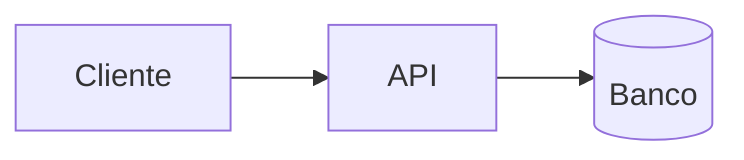

# Design — <Nome da Feature>

> **Camada 3 — O DETALHE TÉCNICO.** A planta baixa da implementação. Quem for codar
> deve conseguir seguir este documento sem precisar inventar decisões importantes.

## 1. Arquitetura

<Diagrama ou descrição dos componentes e como conversam. Use Mermaid se ajudar.>



## 2. Modelo de Dados

### Entidades / Tabelas

```
Tabela: <nome>
- id            <tipo>  PK
- <campo>       <tipo>  <restrições>  -- <descrição>
- created_at    <tipo>
```

- **Relacionamentos:** <1:N, N:N, FKs>
- **Índices:** <quais e por quê>
- **Migrações:** <scripts necessários>

## 3. Contratos de API / Interfaces

### `<MÉTODO> /caminho`

- **Descrição:** <...>
- **Autenticação:** <...>
- **Request:**
  ```json
  { }
  ```
- **Response (200):**
  ```json
  { }
  ```
- **Erros:** `400 <quando>`, `409 <quando>`, ...

## 4. Fluxos Principais

<Passo a passo dos cenários relevantes — feliz e de erro.>

1. <Usuário faz X>
2. <Sistema valida Y (RN-01)>
3. <...>

## 5. Telas / UI (se aplicável)

<Wireframe, descrição de componentes, estados (vazio, carregando, erro).>

> **Mobile first (obrigatório — ver `CLAUDE.md` §4).** Descreva o layout primeiro para a tela
> pequena (≈360px) e depois como ele evolui em `sm:`/`md:`/`lg:`. Alvos de toque ≥ 44px,
> sem scroll horizontal, sem depender de hover. Toda tela deve funcionar de 360px até desktop.

## 6. Validações & Tratamento de Erros

| Situação            | Regra (ref. RN) | Resposta ao usuário |
| ------------------- | --------------- | ------------------- |
| <...>               | RN-01           | <...>               |

## 7. Segurança & Privacidade

- <Autenticação/autorização, dados sensíveis, retenção, LGPD.>

## 8. Observabilidade

- **Logs:** <o que logar>
- **Métricas:** <o que medir>
- **Alertas:** <quando alertar>

## 9. Mapa Spec → Design

> Garante que todo requisito da spec tem cobertura no design.

| Requisito (spec) | Onde é atendido no design |
| ---------------- | ------------------------- |
| RF-01            | <seção / endpoint>        |
| RN-01            | <validação X>             |